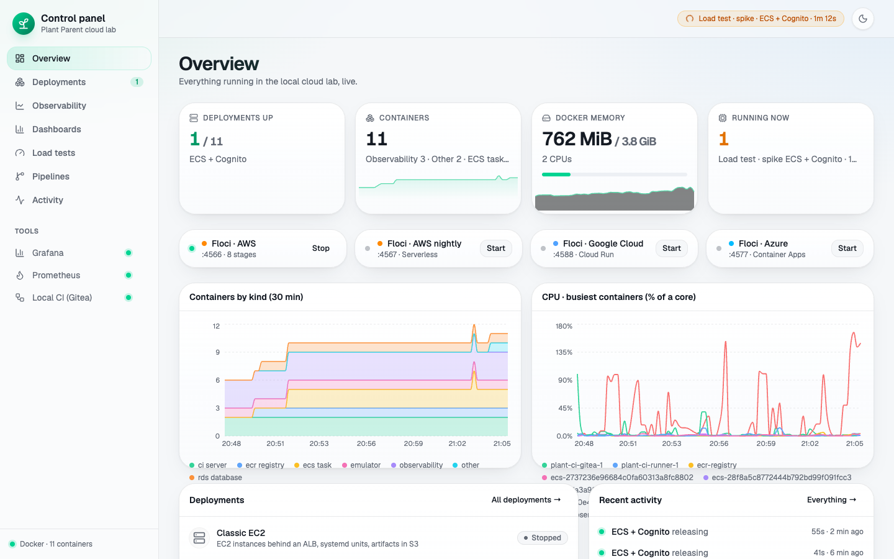
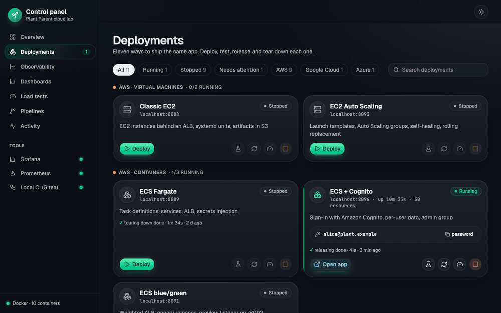
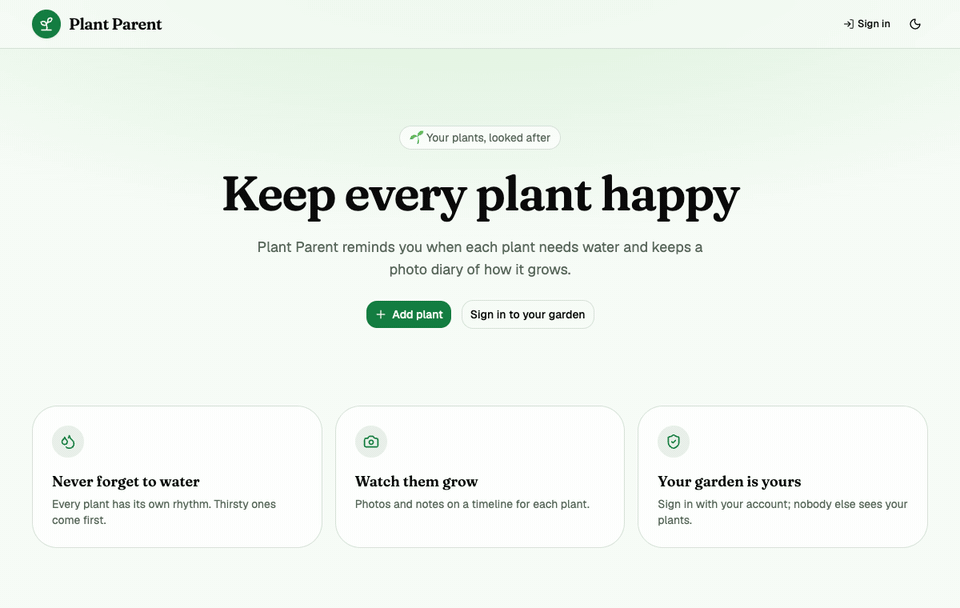
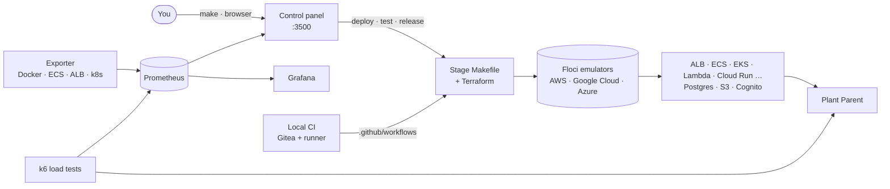
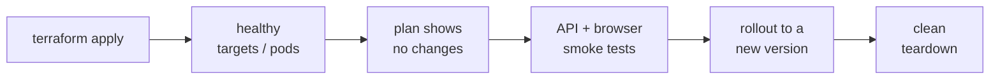
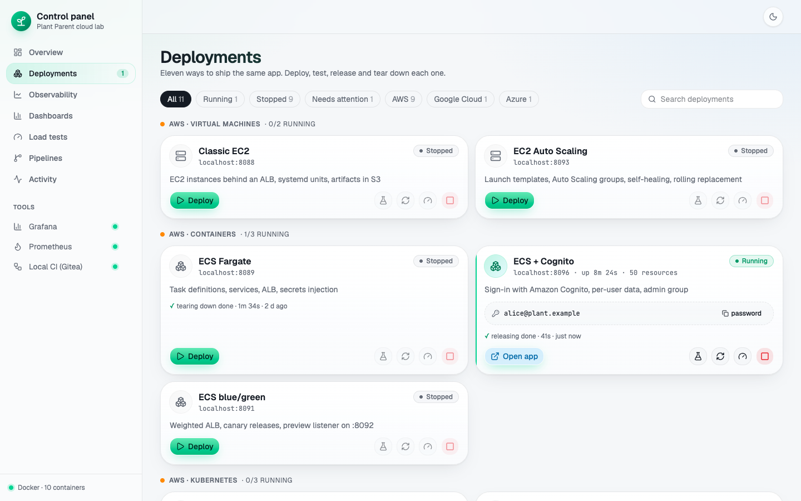
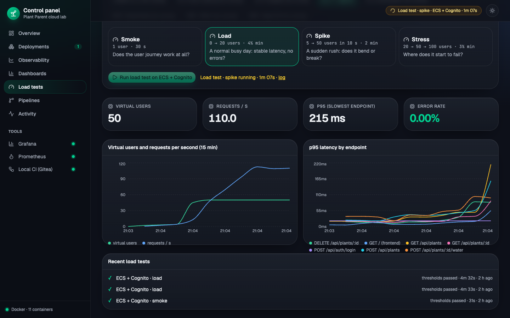
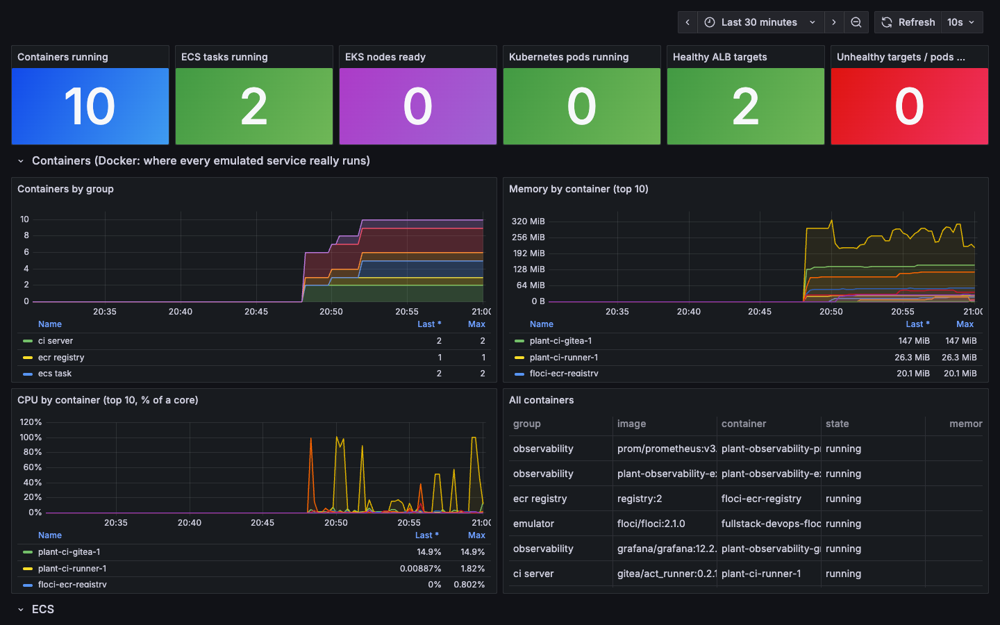
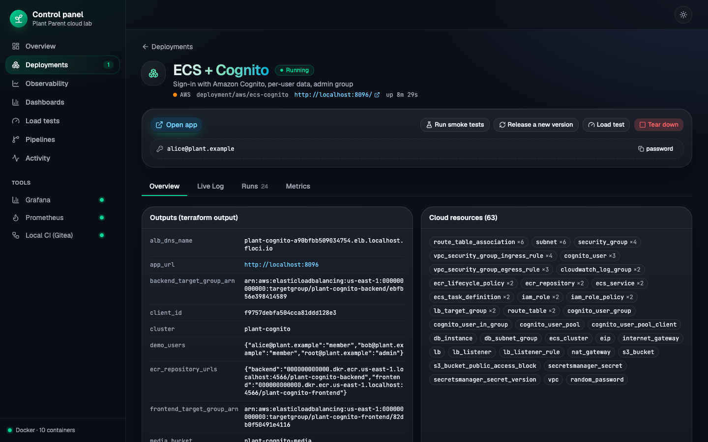

<div align="center">

# FullStack-DevOps

**One full-stack app, deployed twelve different ways — and a local cloud lab to run, watch and test all of them.**


<br>


<picture>
  <source media="(prefers-color-scheme: dark)" srcset="docs/screenshots/control-panel-overview.png">
  
</picture>

[Quick start](#quick-start) · [Demos](#demos) · [How it fits together](#how-it-fits-together) · [Deployments](#deployments) · [The lab](#the-lab) · [Commands](#commands) · [Testing](#testing)

</div>

---

**Plant Parent** is a small houseplant tracker: watering schedules and photo timelines. It's a classic React + Go + Postgres + S3 app, but the app is not the point. It's the subject for learning how real teams ship software: VMs, containers, Kubernetes, GitOps, serverless, blue/green, sign-in with Cognito, on AWS, Google Cloud and Azure.

Everything runs **on your machine**. The clouds are emulated by [Floci](https://floci.io): no cloud account, no bill.

## Quick start

```bash
make                          # start the lab and open the control panel → http://localhost:3500
make deploy STAGE=ecs         # deploy a stage (or press Deploy in the panel)
make smoke STAGE=ecs          # API + browser tests against it
make destroy STAGE=ecs        # tear it down
make help                     # everything else
```

## Demos

<table>
<tr>
<td width="58%"><b>Release a new version from the control panel</b><br>New task-definition revisions roll out, the live log follows every step, a toast reports the result.</td>
<td width="42%"><b>The app: sign in only when you need to</b><br>Visitors land on a public page; "Add plant" asks them to sign in with Cognito, then the form opens.</td>
</tr>
<tr>
<td></td>
<td></td>
</tr>
</table>

## How it fits together



Every stage goes through the same checks, locally and in CI:



## Deployments

| Cloud | Stage | Style | URL |
|---|---|---|---|
|  | [classic-ec2](deployment/aws/classic-ec2/) | EC2 + ALB + RDS, systemd, artifacts in S3 | :8088 |
|  | [ec2-asg](deployment/aws/ec2-asg/) | Launch templates + Auto Scaling groups, self-healing | :8093 |
|  | [ecs](deployment/aws/ecs/) | ECS Fargate + ALB + RDS | :8089 |
|  | [ecs-cognito](deployment/aws/ecs-cognito/) | ECS + Amazon Cognito sign-in, per-user data | :8096 |
|  | [ecs-blue-green](deployment/aws/ecs-blue-green/) | Weighted ALB, canary, instant rollback | :8091 |
|  | [eks](deployment/aws/eks/) | Kubernetes with Kustomize | :8090 |
|  | [eks-helm](deployment/aws/eks-helm/) | The app as a Helm chart | :8094 |
|  | [eks-gitops](deployment/aws/eks-gitops/) | Argo CD syncs the cluster from git | :8095 |
|  | [serverless-cognito](deployment/aws/serverless-cognito/) | Lambda + API Gateway + CloudFront with Cognito sign-in | plant-auth.localhost:4568 |
|  | [serverless](deployment/aws/serverless/) | Lambda + API Gateway + S3 + CloudFront | plant.localhost:4567 |
|  | [cloud-run](deployment/gcp/cloud-run/) | Cloud Run + Cloud SQL + Cloud Storage | from `terraform output` |
|  | [container-apps](deployment/azure/container-apps/) | Container Apps + PostgreSQL Flexible Server | from `terraform output` |

<details>
<summary><b>What each stage teaches</b></summary>

| Stage | You learn |
|---|---|
| classic-ec2 | public/private subnets, security groups, EC2 UserData + systemd, instance profiles, Secrets Manager |
| ec2-asg | launch templates and versions, Auto Scaling groups, ALB registration by the group, self-healing, rolling replacement |
| ecs | images in ECR, task definitions, services, execution vs task roles, secrets injection |
| ecs-cognito | user pools and app clients, JWT verification with JWKS, per-user data, an admin group, HttpOnly refresh cookies |
| ecs-blue-green | blue/green and canary releases, weighted target groups, a preview listener, instant rollback |
| eks | cluster vs app layer, Kustomize, NodePort + ALB, `aws eks get-token` auth |
| eks-helm | charts, values, releases and revisions, `helm upgrade --install`, `helm rollback` |
| eks-gitops | the repo as source of truth, a release is a commit, rollback is `git revert`, drift self-healing |
| serverless-cognito | sign-in on Lambda: JWT checks in the function, cookies through API Gateway, per-user data |
| serverless | function packaging, cold starts, versions and aliases, CloudFront origins, a private S3 site |
| cloud-run | revisions, Cloud SQL, Cloud Storage, service accounts |
| container-apps | Container Apps revisions and ingress, PostgreSQL Flexible Server |

Rules for adding a stage and what comes next: [deployment/ROADMAP.md](deployment/ROADMAP.md).
</details>

## The lab

| | |
|---|---|
| **[Control panel](control-panel/)** — deploy, test, release and tear down every stage; live logs, run history, Terraform outputs and resources per stage; light and dark themes |  |
| **[Load tests](loadtest/)** — k6 virtual users sign in and use the app (smoke, load, spike, stress); users, requests/s, p95 and errors live |  |
| **[Observability](observability/)** — Prometheus + Grafana: containers, ECS tasks, Kubernetes pods, load balancer health, k6 results |  |
| **Per-stage detail** — Terraform outputs, every cloud resource, the commands behind each button, logs and metrics |  |
| **[Local CI](local-ci/)** — Gitea + an Actions runner execute the repo's own `.github/workflows` on your machine | The same pipelines as GitHub, one per deployment family |

## Commands

| Command | What it does |
|---|---|
| `make` | start Prometheus, Grafana and the control panel in the background, open the panel |
| `make stages` | list every deployment and its state |
| `make deploy STAGE=<stage>` | deploy (also `destroy`, `smoke`, `release`, `forget`): runs through the panel, the log streams in your terminal |
| `make loadtest STAGE=<stage> PROFILE=load` | k6 load test (`smoke`, `load`, `spike`, `stress`) |
| `make ci-up` · `make ci-down` | start or stop the local CI (Gitea) |
| `make dashboard-down` | stop the panel and observability (deployments keep running) |
| `make up` · `make backend` · `make frontend` · `make test` | develop the app itself: Postgres + Floci, Go API on :8080, Vite on :5173, unit tests |

## Repository layout

```
frontend/  backend/               the app: React + Vite + Tailwind + shadcn/ui, Go + Echo, Postgres, S3
frontend-auth/ backend-auth/      the same app with Cognito sign-in (used by ecs-cognito)
backend-serverless/ backend-gcp/  the API adapted to Lambda and to Cloud Storage
deployment/                       one folder per deployment style, plus the shared smoke tests (deployment/smoke)
control-panel/                    the lab's web UI (React SPA) and its small Python API
observability/                    Prometheus, Grafana and an exporter for Docker, ECS, ALB and Kubernetes
loadtest/                         k6 scripts and profiles
local-ci/                         Gitea + runner for the GitHub workflows (.github/workflows)
docs/                             design notes and screenshots
```

## Requirements

Docker (Rancher Desktop or Docker Desktop, 4 GB+), Terraform 1.14, Go 1.26, Node 22, Python 3, AWS CLI v2, kubectl and Helm for the EKS stages. k6 is optional (the load tests run it in Docker). macOS and Linux.

A laptop runs two or three stages at once comfortably. The emulators keep everything in memory, so restarting Docker resets them; the control panel notices and redeploys from a clean state.

## Testing

| Level | How |
|---|---|
| App | `make test`: Go unit + Postgres/S3 integration tests, Vitest |
| Each deployment | `make smoke STAGE=…`: API journey + Playwright browser tests (sign-in, plants, photos, deep links) |
| Load | `make loadtest STAGE=…`: k6 with thresholds (errors < 1 %, p95 < 500 ms) |
| Infrastructure | CI runs `terraform fmt`/`validate`, tflint, trivy and shellcheck on every stage |
| Control panel | `make -C control-panel test`: every page, every link, the main controls |
| Pipelines | one workflow per deployment family in `.github/workflows`, runnable locally via `local-ci/` |
