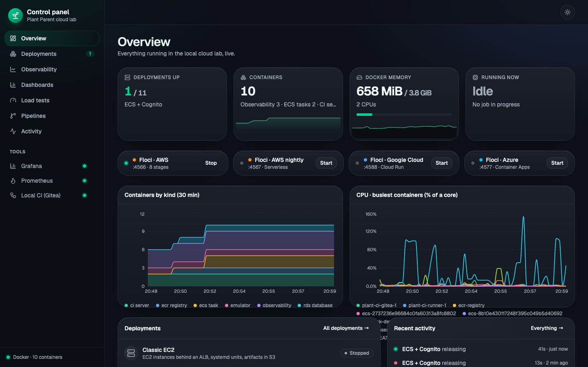
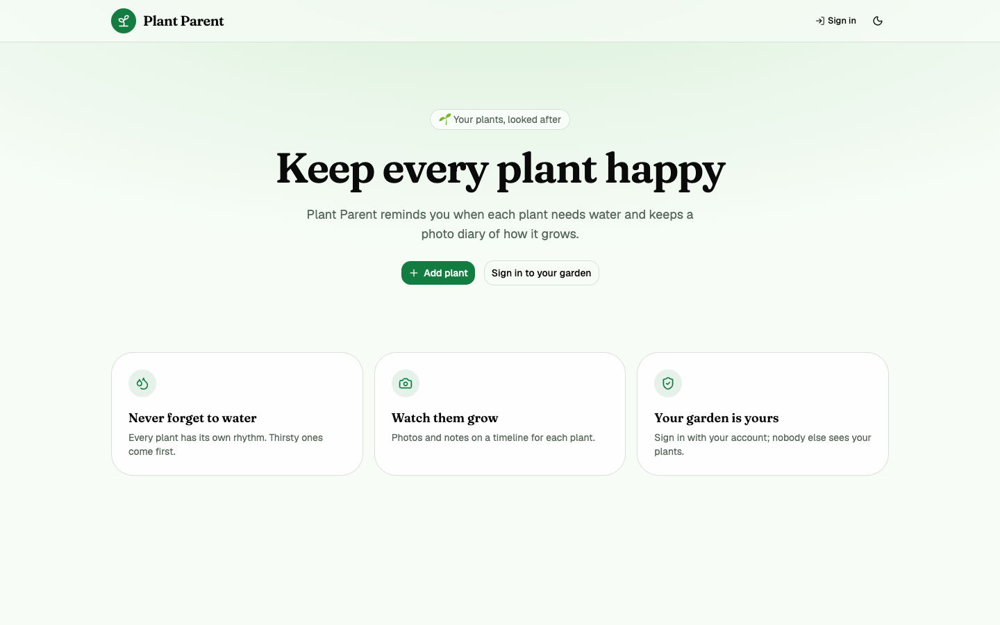

# FullStack-DevOps

**One full-stack app, deployed eleven different ways — and a local cloud lab to run, watch and test all of them.**




**Plant Parent** is a small houseplant tracker (watering schedules, photo timelines). It's a classic React + Go + Postgres + S3 app — but the app is not the point. It's the subject for learning how real teams ship software: VMs, containers, Kubernetes, GitOps, serverless, blue/green, sign-in with Cognito — on AWS, Google Cloud and Azure.

Everything runs **on your machine**. The clouds are emulated by [Floci](https://floci.io): no cloud account, no bill.

```bash
make                          # starts the lab and opens the control panel → http://localhost:3500
make deploy STAGE=ecs         # deploy a stage (or press Deploy in the panel)
make help                     # everything else
```

## How it fits together


## What's inside

| | |
|---|---|
| **11 deployment recipes** | Each one a standalone folder: Terraform, Makefile, scripts, README. EC2, Auto Scaling, ECS, ECS + Cognito, ECS blue/green, EKS (Kustomize, Helm, Argo CD), Lambda + CloudFront, Cloud Run, Container Apps. → [deployment/](deployment/) |
| **Control panel** | A web app to deploy, test, release and tear down every stage, with live logs, run history, metrics, load tests and pipelines. → [control-panel/](control-panel/) |
| **Observability** | Prometheus + Grafana: containers, ECS tasks, Kubernetes pods, load balancer health. → [observability/](observability/) |
| **Load testing** | k6 virtual users (smoke, load, spike, stress) with live results in Grafana and the panel. → [loadtest/](loadtest/) |
| **Local CI** | Gitea + Actions runner executing the repo's own GitHub workflows on your machine. → [local-ci/](local-ci/) |
| **Tests everywhere** | Unit and integration tests, API + browser smoke tests after every deploy, IaC checks (fmt, validate, tflint, trivy). |

## Deployments

| Cloud | Stage | Style | URL |
|---|---|---|---|
| AWS | [classic-ec2](deployment/aws/classic-ec2/) | EC2 + ALB + RDS, systemd, artifacts in S3 | :8088 |
| AWS | [ec2-asg](deployment/aws/ec2-asg/) | Launch templates + Auto Scaling groups, self-healing | :8093 |
| AWS | [ecs](deployment/aws/ecs/) | ECS Fargate + ALB + RDS | :8089 |
| AWS | [ecs-cognito](deployment/aws/ecs-cognito/) | ECS + Amazon Cognito sign-in, per-user data | :8096 |
| AWS | [ecs-blue-green](deployment/aws/ecs-blue-green/) | Weighted ALB, canary, instant rollback | :8091 |
| AWS | [eks](deployment/aws/eks/) | Kubernetes with Kustomize | :8090 |
| AWS | [eks-helm](deployment/aws/eks-helm/) | The app as a Helm chart | :8094 |
| AWS | [eks-gitops](deployment/aws/eks-gitops/) | Argo CD syncs the cluster from git | :8095 |
| AWS | [serverless](deployment/aws/serverless/) | Lambda + API Gateway + S3 + CloudFront | plant.localhost:4567 |
| Google Cloud | [cloud-run](deployment/gcp/cloud-run/) | Cloud Run + Cloud SQL + Cloud Storage | from `terraform output` |
| Azure | [container-apps](deployment/azure/container-apps/) | Container Apps + PostgreSQL Flexible Server | from `terraform output` |

Every stage passes the same checks: deploy → healthy → idempotent plan → API and browser smoke tests → rollout → clean teardown. Details, what each one teaches and the rules for adding one: [deployment/README.md](deployment/README.md) and [deployment/ROADMAP.md](deployment/ROADMAP.md).

## Screenshots

| Deploy, test and release from the control panel | Every stage's Terraform outputs, resources, logs and runs |
|---|---|
|  |  |
| **The app: public home page, sign-in only when you act** | **Grafana: containers, ECS tasks, pods, target health** |
|  |  |

## Repository layout

```
frontend/  backend/            the app: React + Vite + Tailwind + shadcn/ui, Go + Echo, Postgres, S3
frontend-auth/ backend-auth/   the same app with Cognito sign-in (used by ecs-cognito)
backend-serverless/ backend-gcp/  the API adapted to Lambda and to Cloud Storage
deployment/                    one folder per deployment style, plus the shared smoke tests (deployment/smoke)
control-panel/                 the lab's web UI (React SPA) and its small Python API
observability/                 Prometheus, Grafana and an exporter for Docker, ECS, ALB and Kubernetes
loadtest/                      k6 scripts and profiles
local-ci/                      Gitea + runner for the GitHub workflows (.github/workflows)
docs/                          design notes
```

## Commands

| Command | What it does |
|---|---|
| `make` | start Prometheus, Grafana and the control panel in the background, open the panel |
| `make stages` | list every deployment and its state |
| `make deploy STAGE=<stage>` | deploy (also `destroy`, `smoke`, `release`, `forget`) — runs through the panel, log in your terminal |
| `make loadtest STAGE=<stage> PROFILE=load` | k6 load test (`smoke`, `load`, `spike`, `stress`) |
| `make ci-up` | start the local CI (Gitea) |
| `make dashboard-down` | stop the panel and observability (deployments keep running) |
| `make up` · `make backend` · `make frontend` · `make test` | develop the app itself: Postgres + Floci, Go API on :8080, Vite on :5173, unit tests |

## Requirements

Docker (Rancher Desktop or Docker Desktop, 4 GB+), Terraform 1.14, Go 1.26, Node 22, Python 3, AWS CLI v2, kubectl and Helm for the EKS stages. k6 is optional (the load tests run it in Docker). macOS and Linux.

A laptop runs two or three stages at once comfortably; the emulators keep everything in memory, so a restart of Docker resets them (the control panel notices and redeploys from a clean state).

## Testing

| Level | How |
|---|---|
| App | `make test` — Go unit + Postgres/S3 integration tests, Vitest |
| Each deployment | `make smoke STAGE=…` — API journey + Playwright browser tests (sign-in, plants, photos, deep links) |
| Infrastructure | CI runs `terraform fmt`/`validate`, tflint, trivy and shellcheck on every stage |
| Control panel | `make -C control-panel test` — every page, every link, the main controls |
| Pipelines | one workflow per deployment family in `.github/workflows`, runnable locally via `local-ci/` |
